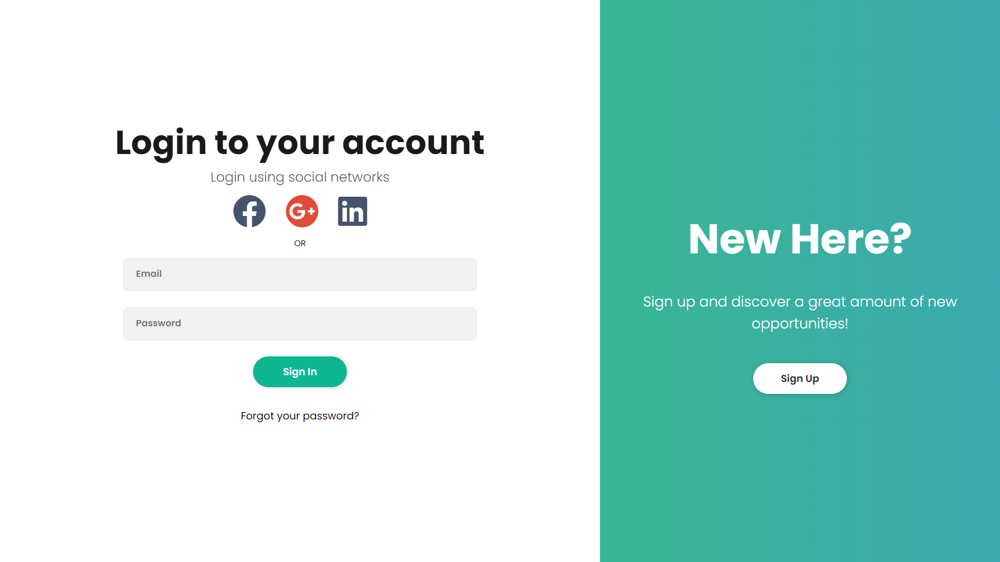

# Login-Page com HTML5, CSS3 e JS.
 

### Introdução
Essa é uma página estática criada para testar meus conhecimentos em HTML5 e CSS3.

### Tecnologias utilizadas
Utilizei HTML5, CSS3 e JavaScript para criar a página.

### Responsividade
Foi adicionado um sistema de responsividade básico na página diminuindo o tamanho da fonte da página para adaptação.

* A partir de 900px:
- O display da página sai de grid para block, colocando o conteúdo principal e adiciona uma rolagem vertical para a continuação do conteúdo.

- Surge uma nova opção na login-options para caso não seja registrado. Ao clicar na opção, a página scrolla automaticamente ao final para mostrar o conteúdo restante.

### Unidades de medidas responsivas
Foram utilizadas unidades responsivas nos paddings e font-size: rem, acompanhando o root do CSS.

### Tecnologia Grid
A fim de evitar o display flex com width pré-definido,foi utilizada uma tecnologia mais recente do CSS, display grid.

### Agradecimentos e créditos
- FontAwesome: site de ícones para HTML.
- Rocketseat: conhecimentos sobre responsividade e display grid.
- Justinmind: template artístico da página.
- CursoEmVideo: conhecimentos sobre HTML5 e CSS3.
